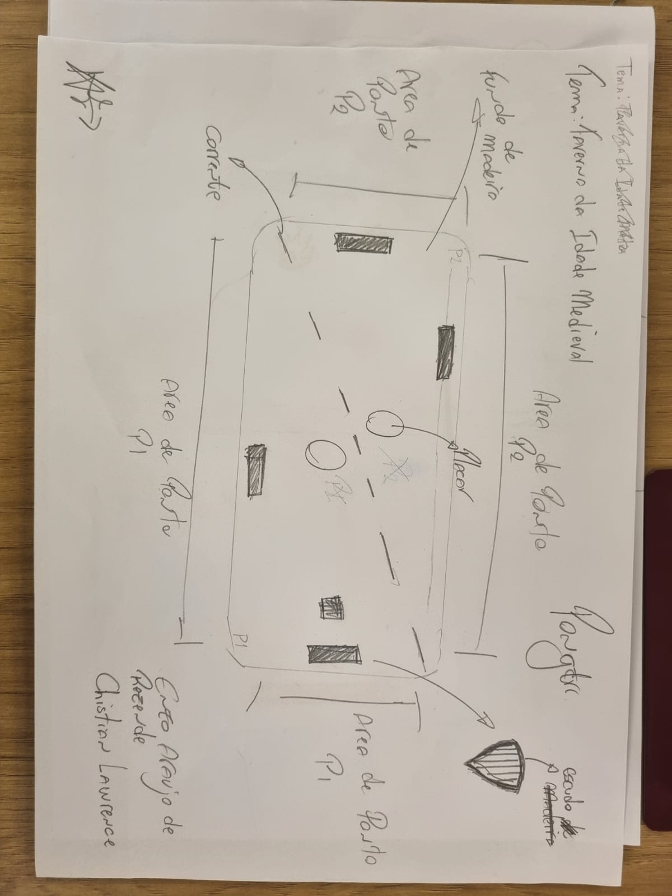
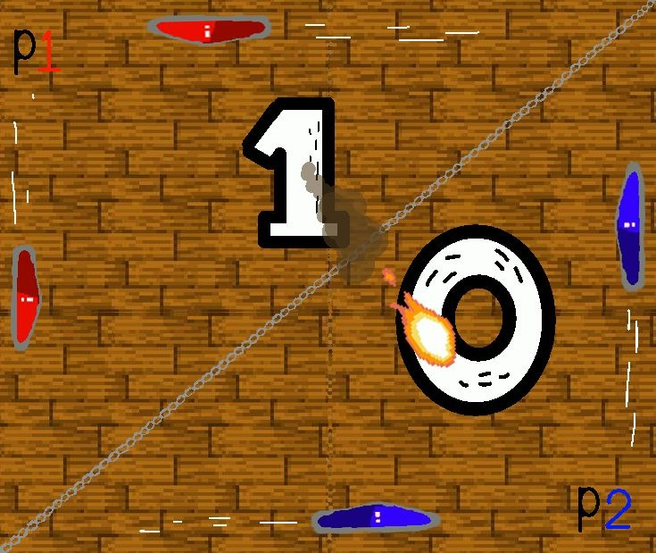

# Relatorio Christian Lawrence - Enzo Rezende

## 1. Introdução  
O objetivo desse exercicio é a reimaginação do jogo primordial para os games o PONG, assim, desenvolver habilidades de crição e imaginação para o desenvolvimento de algo como Pong porém diferente e novo, algo mais moderno mas sem perder a essência do original,
*Descreva brevemente o objetivo da atividade, mencionando a proposta de reinvenção do jogo Pong e a abordagem escolhida pela dupla.*
 
---

## 2. Pesquisa e Análise Inicial
*O jogo **Pong** tem como característica principal e básica a simplicidade de comandos onde na tela há apenas uma sequência de quadrados que forma uma linha dividindo a tela, um quadrado que se comporta como uma bola e dois retângulos que ajem como raquetes tentando bater a bola para o outro lado com o objetivo de marcar pontos, caso o adversario não consiga mandar a bola de volta. Sendo assim o motivo do **Pong** ser tão envolvente é que a facilidade de seus comandos está em perfeito equilibrio com o sistema de dificultação do jogo que consiste em aumentar a velocidade da bolinha toda vez que ela encostar na raquete tornando ele divertido.

---

## 3. Proposta de Reinvenção    

*- **Tema e Ambientação:** O novo pong pensado por nós tem o tema da era medieval, sendo sua tela de fundo uma taverna com o chão de madeira dividido na diagonal por uma corrente.*

*- **Personagens ou Elementos Visuais:** Para combinar com o tema medieval transformamos as raquetes retangulares em escudos de cavaleiros divididos entre as cores vermelho e azul, para representar a bola modificamos seu visual para uma bola de fogo*

*- **Mudanças na Mecânica:** A única alteração na jogabilidade do game é que no nosso jogo ao invés de 1 escudo cada jogador terá 2 escudos para controlar, sendo 1 de movimentação vertical e um de movimentação horizontal, primeiro utilizará as setas para cima e para baixo, e o outro usará as teclas (A) e (D) para os movimentos horizontais*

*- **Objetivo da Reinvenção:** Essa versão pretende explorar a possibilidade de se jogar o pong com as duas mãos ou até mesmo em dupla localmente na máquina por conta dos controles separados.*

*Básicamente nós tivemos a ideia de fazer um upgrade no pong original para o multiplayer local então decidimos que não seria intuitivo para os jogadores o layout natural do pong assim o modificamos para ter uma divisão de tela na diagonal tendo mais espaço para cada escudo se movimentar*

---

## 4. Tela Digital do Jogo  

  *A concept foi adaptada de forma fiel e seguindo a ideia inicial que tivemos no começo do projeto, claro, sofrendo estilizações que não foram possiveis de serem representadas no papel tão precisamente, porém sempre seguindo a mesma linha de criação do inicio.*

  *Na nossa visão todos os aspectos gráficos tiveram certo upgrade na questão visual mas principalmente os raquetes se tornaram escudos com formas específicas e cores diferentes e a propria bola sofreu um nivel de detalhamento.*

*- Tudo no nosso jogo foi idealizado pensado voltado para melhorar a imersividade e experiência do jogador*  

---

## 5. Reflexão e Aprendizados - Christian de Carvalho Lawrence

1. Quais foram os maiores desafios enfrentados durante o processo de criação?

   *Os maiores desafios enfrentados foram como decidir as cores que seriam usadas e a como mostrar de forma clara, concisa e concreta a ideia.*

2. Que habilidades foram desenvolvidas ou aprimoradas ao longo da atividade?

   *As habilidades foram a Capacidade de explicar uma ideia e concretizá-la.*
   
## 5. Reflexão e Aprendizados - Enzo Rezende

1. Quais foram os maiores desafios enfrentados durante o processo de criação?

    *Um dos maiores desafios foi a digitalizar a iideia representada no papel

2. Que habilidades foram desenvolvidas ou aprimoradas ao longo da atividade?

    *A habildade desenvolvida foi a de representar a ideia no meio digital.*
   
---

## 6. Referências  
*Não houveram fontes*

---
